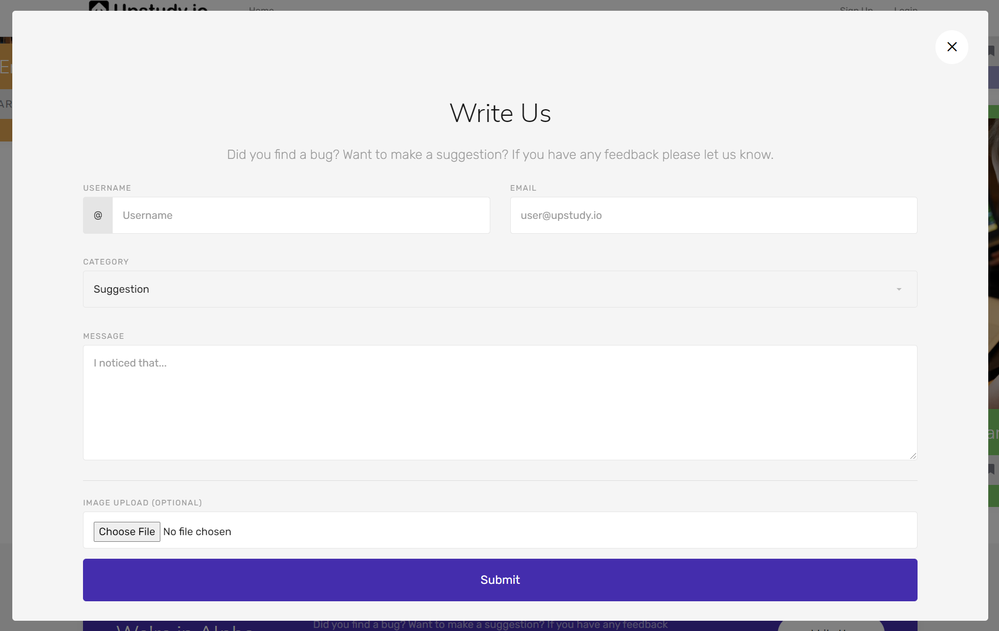
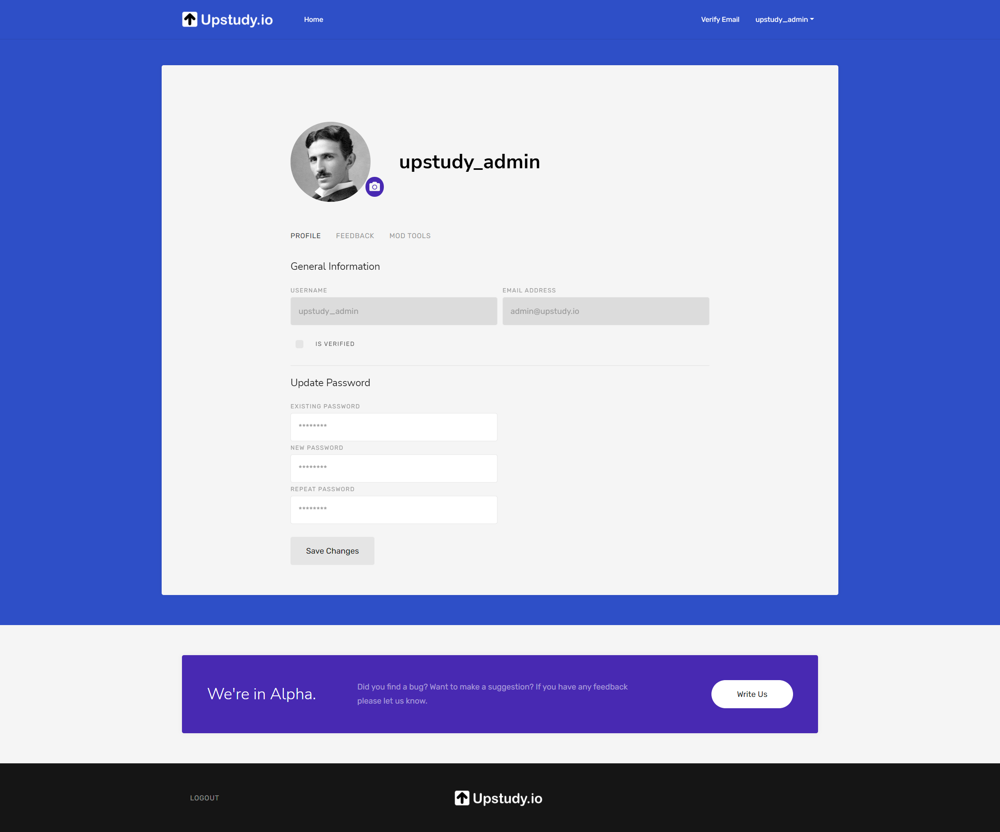
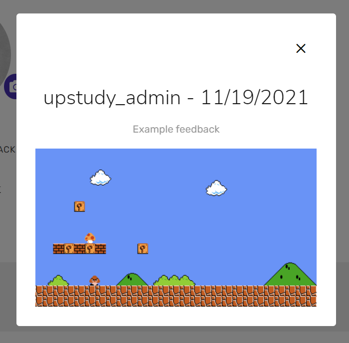
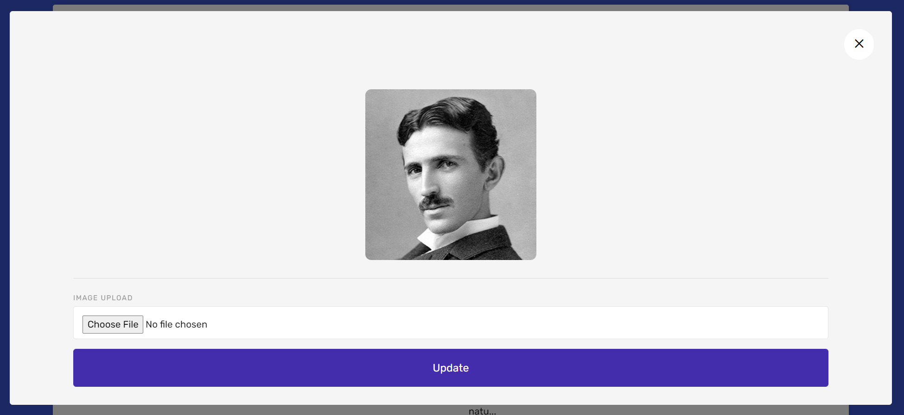
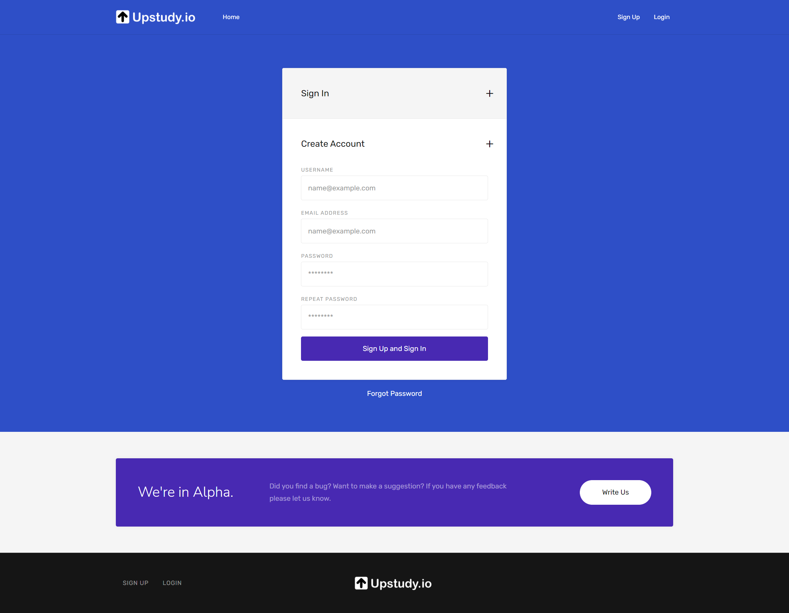
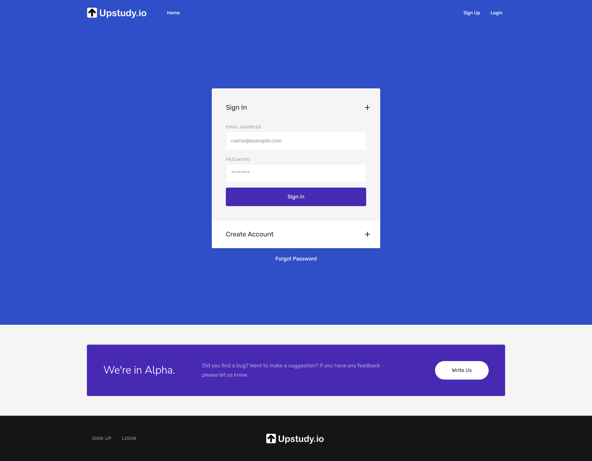
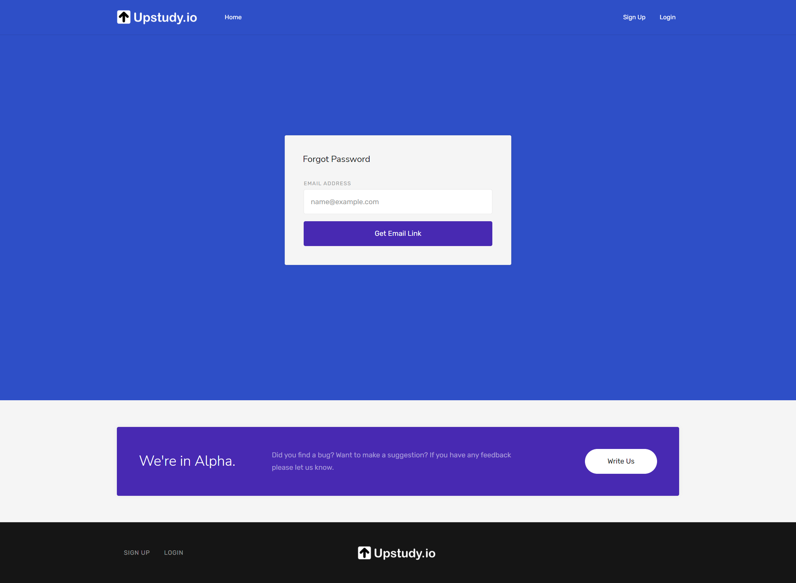
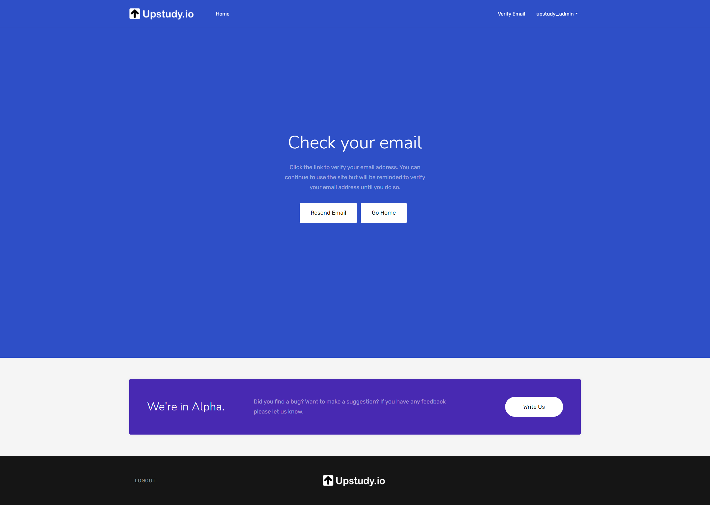
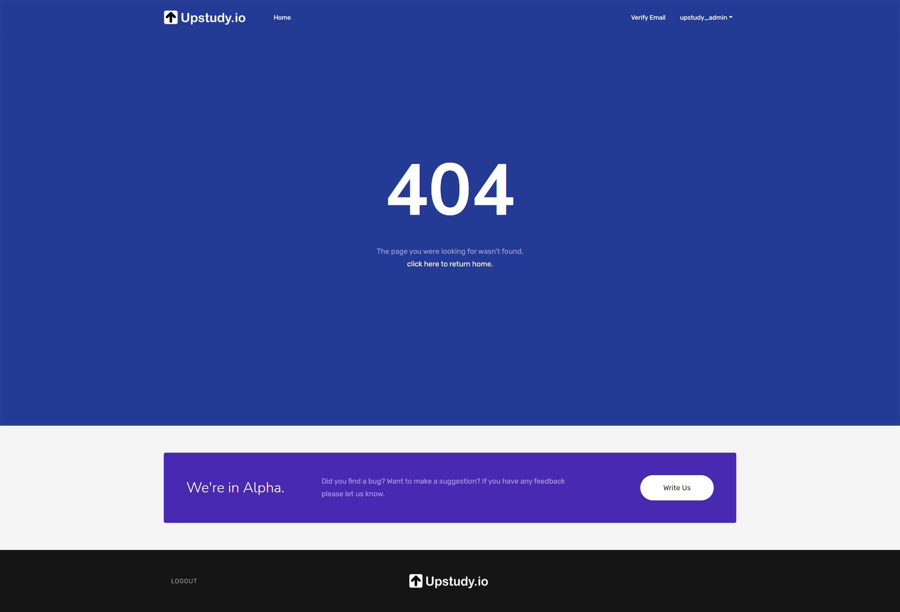

# Upstudy.io - React, Redux, GraphQL, Apollo Server, MongoDB, Mongoose, Node.js, Express.js, Fullstack, MERN

Upstudy is a new way to find relevant learning content by allowing the highest quality material for any subject rise to the top. Currently, there are many different places to look when searching for study material on a particular topic. You might find results at YouTube, Khan Academy or Stack Overflow but which is the best place to spend your time learning? Upstudy allows users to delve into specific study topics and be presented with the top content links as voted by the community as well as meta discussions and moderation on the study topic.

[A live demo can be found here.](https://upstudy.herokuapp.com/)

Since you can't fork your own repos, this project was initially duplicated from my [web portfolio repo](https://github.com/DavidTunnell/david-tunnell-dot-com-react-mern). I then integrated the user account, authentication, GraphQL, Apollo server and client functionality from my [reading list search engine repo](https://github.com/DavidTunnell/reading-list-search-engine-graphql-apollo-server-react-node-express-mongodb). The web apps functionality is being built on top of this base.

The user management system utilizes JSON Web Tokens generated on the server during login and then passed on subsequent calls from the client for additional security. The token also contains information about the user that is logged in. The server also checks the validity of these tokens when making calls that are behind authentication via custom middleware (`authMiddleware()`). Since it is added as a header for the Apollo Server wrapper it works everywhere in the React application. Additionally, there is functionality to send emails for various user actions such as verifying an email address, forgetting a password and more using Send Grid.

This project uses the following technologies/libraries.

-   [GraphQL](https://graphql.org/) as an API Querying Language
-   [Apollo-Server-Express](https://www.npmjs.com/package/apollo-server-express) to Run a Spec-Compliant GraphQL Server with Express
-   [@apollo/client](https://www.npmjs.com/package/@apollo/client) to Work with GraphQL on the React App
-   [GraphQL-Rate-Limit](https://www.npmjs.com/package/graphql-rate-limit) for Rate Limiting on Server Calls where Necessary
-   [React](https://reactjs.org/) as a Fast and Powerful Frontend
-   [React-Router-Dom](https://www.npmjs.com/package/react-router-dom) for URL routing, URL parameters, Browser History Stack Usage, and Linking without Calling the Server
-   [Redux](https://redux.js.org/) and [React-Redux](https://react-redux.js.org/) for Global State Management and Predictability
-   [Redux-Persist](https://redux.js.org/) to Maintain Redux Data Stores across Server Refreshes
-   [AWS-SDK](https://redux.js.org/) to Connect with AWS and Utilize s3 Storage for Images
-   [Bootstrap 4](https://getbootstrap.com/docs/4.0/getting-started/introduction/) as a CSS Framework
-   [GO Bootstrap Template](https://themes.getbootstrap.com/product/go-multipurpose-landing-page-template/) as a Template that was Imported into React
-   [Font Awesome](https://fontawesome.com/) for Various Icons / Graphics
-   [Node.js](https://nodejs.org/en/) and [Express.js](https://expressjs.com/) as the Server for API and HTTP Requests and Serving the React Build Directory Frontend
-   [MongoDB](https://www.mongodb.com/) as a NoSQL Database
-   [Mongoose](https://mongoosejs.com/) for [Object Relational Mapping](https://en.wikipedia.org/wiki/Object%E2%80%93relational_mapping), Database Interaction, [Routing](https://expressjs.com/en/guide/routing.html) and Collection Generation and Seeding
-   [Nodemon](https://nodemon.io/) for More Pleasant Node.js Development
-   [Concurrently](https://nodemon.io/) to Run Multiple Dev Commands on a Single Terminal
-   [Bcrypt Package](https://www.npmjs.com/package/bcrypt) for Password Hashing and Management
-   [React-Ga](https://www.npmjs.com/package/react-ga) to Track Website Traffic Data with Google Analytics
-   [JSON Web Tokens](https://jwt.io/) for Additional User Security
-   [Jsonwebtoken](https://www.npmjs.com/package/jsonwebtoken) to Utilize JWT Technology in the App
-   [Jwt-Decode](https://www.npmjs.com/package/jwt-decode) to Decode Token Data
-   [Simple-React-Validator](https://www.npmjs.com/package/simple-react-validator) for Client-Side User Input Validation
-   [Nodemailer](https://www.npmjs.com/package/nodemailer) and [Nodemailer-Sendgrid-Transport](https://www.npmjs.com/package/nodemailer-sendgrid-transport) to Send Email Communications to Users
-   [Open-Graph-Scraper](https://github.com/jshemas/openGraphScraper)

## Installation

The client and server are two discrete applications. After cloning the repo, simply run `npm install` to get the packages for both the client and server. Then run `npm run dev` to run both the Node sever using Nodemon and the React Client using it's built in dev server. You need to install Concurrently for this command to work. It can be installed with `npm install -g concurrently`. The `npm run start` command is used when deploying the applications to a server.

The application will be available by default at `http://localhost:3000/` and API will be at `http://localhost:3001/graphql` if you are using a local development environment. It's assumed you already have MongoDB running on your development computer.

## GraphQL API

Followed are example queries and mutations that can be run directly against the server.

Get User:

```
query {
  user(userId: "6175968953cf7f1e50489e24") {
        _id
        username
        email
        password
        savedBooks {
            authors
            description
            bookId
            image
            link
            title
    }
  }
}
```

Get Users:

```
query Query {
  users {
    _id
    username
    email
    password
    savedBooks {
        authors
        description
        bookId
        image
        link
        title
    }
  }
}
```

# Screenshots

## Homepage


## Beta Feedback Modal



## Dashboard Profile



## Feedback Details



## View / Update Profile Pic



## Signup



## Login



## Forgot Password



## Verify Email



## 404


